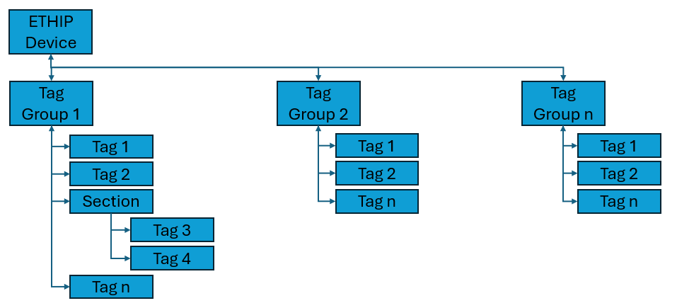

## Disclaimer

Rockwell Automation maintains these repositories as a convenience to you and other users. Although Rockwell Automation reserves the right at any time and for any reason to refuse access to edit or remove content from this Repository, you acknowledge and agree to accept sole responsibility and liability for any Repository content posted, transmitted, downloaded, or used by you. Rockwell Automation has no obligation to monitor or update Repository content

The examples provided are to be used as a reference for building your own application and should not be used in production as-is. It is recommended to adapt the example for the purpose, observing the highest safety standards.

## Overview

The Ethernet/IP Client provides all the necessary Types and sample
code to read and write CIP Parameter from/to an Ethernet/IP Device
using CIP Services. It also provides core Types to create custom
Services to be executed.

It supports simple access to single CIP Parameter by providing Class,
Instance and Attribute, similar to read and write Parameter in Logix.

The Core Types are not meant to be used directly. Inherit from those
to create your own types.

## Functional Overview

### Ethernet/IP Device

The Ethernet/IP Device Type enables FactoryTalk Optix to connect to a device and to execute CIP Services on that device. The client provides the following features/functionalities:

-   Sends CIP Messages to the device.
-   Provides predefined Tag Types to read or write CIP Parameter by just     specifying Class, Instance and Attribute.
-   Automatically get the CIP Identity Object at Runtime.
-   Support of multiple running instances to connect to different devices.
-   Each device supports multiple Tag Groups to optimize performance.
-   Custom CIP Service Core included to enable advanced messages.

### Ethernet/IP Tag Group

-   Allows processing of multiple Tags with one command or on a periodic
    base. All communication is done on the Device.
-   Configurable Update Rate or manually read/write.
-   Multiple groups are supported in one device to allow different     update rates.
-   Needs to be placed into a Device Object.

### Ethernet/IP Tag

-   Represents a single CIP Parameter by specifying Class, Instance and     Attribute.
-   Using CIP Services Get Attribute Single (0xE) and Set Attribute     Single (0x10)
-   Predefined Value-Types: DINT, UDINT, INT, UINT, UINT Array, SINT,     USINT, REAL, BOOL, STRING, ShortSTRING.
-   Custom Data Type support.
-   Support manual read and write of the CIP Parameter.
-   Needs to be placed inside a Tag Group.
-   Includes a CIPQuality property.

### Custom Message

-   Executes any custom service on the device by specifying Service     Code, Class, Instance and Attribute.
-   This core type enables the creation of custom services by inheriting     from this core.
-   Just add parsing logic to the data change event and decode the bytes.

## Code Architecture

### Physical Model

The connection to the device is always handled by the ETHIPDevice
Object. The Tag Objects sends their requests to the ETHIP Device which
is doing the communication.

All Tag must belong to a Tag Group which must belong to a Device.
Placing a Tag somewhere else will result in a Configuration Error.

Each Tag has Runtime Script to encode/decode their own data.
All Properties of the objects are documented in FTOptix.

### Sample Objects 

In the Model of the Project, you will find the folder `rac_ETHIPSamples`. There are a few examples of how to use the CIP communication.

### Sample Network Layout

The following Network Layout is used for the demo:

All the communication is done by sending the requests to the
controller with IP 192.168.2.30, which will be our single point of
contact.

### raC_ETHIPDirect

This Object is the PLC where FTOptix is connected to.

Inside this Object we have one Tag Group containing one single Tag, in
this sample the Catalog Number as String, and 2 custom services to
read the CPU and Task Load from the controller.

### raC\_ETHIPRoute

This Object is pointing to the same controller but also uses a ETHIP
Route to access another controller with IP of `192.168.1.10`, which is
connected via an Ethernet Card. The Route reads as: Backplane, Slot 3,
Ethernet, IP.

Ther is just one Tag in one Tag Group, reading the Catalog as CIP
Parameter for demonstration.

### RemoteDI

This connects to a single Digital Input Card of a Point IO with IP
`192.168.1.60`.

Again, the Path is set to the single point of entry, the PLC, and the
Route is specified.

The Route reads like this: Backplane, Slot 3, Ethernet, IP, Backplane,
Slot 1

In the Tag Group are 2 Tags of type Boolean, which are reading the
current state of the 1^st^ and 2^nd^ input. Note that the Tags are
grouped in an additional Object called "Inputs". You can organize tags
inside a group based on your needs.

### RemoteAI

Using the same approach as we have used for RemoteDI. Just the last
segment of the Route is set to 3 as this is the Analog Input Card of
the Point IO. You will find the value and the status of the first
input.

### EDS File Importer 

Ther is a Net Logic to import EDS files at Design Time.

The following Properties are available:

EDSFilePath: Browse to the EDS file to import. To find the right one,
you can use FTLinx, browse to the device and select properties. There
you will find the EDS filename.

EDF files by default are located in
`C:\Users\Public\Documents\Rockwell\EDS\`. Ignore the last 3
digits of the name (xxx) and search the directory.

Note that not all devices are supporting Class/Instance/Attribute
Parameter in Class 3 Messaging, so the result might be empty.

Destination: The Folder in FTOptix where the imported Object should be
created in. The new

To import, right-click on the Importer and select `Execute
importAsDeviceType`. The new device type will be createt in the
destination and all parameters are put in an unscheduled Tag Group.
You will need to create a new Tag Group and move the Parameter into it
if you whant to use them.

